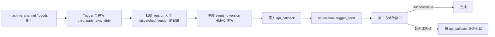

# V2 第三方商品主动同步部署说明

## 业务边界

- 嘉潮汇是调用方，主动调用第三方提供的设备商品修改接口和核心商品修改接口。
- 不新增等待第三方调用的 V2 查询接口；现有 `get_inventory_list`、`get_goods_lists` 保持原响应结构。
- 数据库 Trigger 只记录变化，不发起 HTTP；第三方故障不阻塞设备、库存、订单和商品业务。
- 仅同步 `ao_id=17` 的设备及核心商品。
- 数据库脚本以 MySQL 5.6 为兼容基线，不使用 CTE、窗口函数、JSON 类型、`SKIP LOCKED` 或同事件多 Trigger。

## 数据流



## 接收方接口地址（测试 / 生产服务器）

两个接收接口在测试、生产服务器上的完整地址如下（域名来自微程 msvc-shop 文档）：

| 环境 | 核心商品 syncGoods | 设备商品 syncMachineProduct |
|---|---|---|
| 测试服务器 | `https://test-admin-weicheng.jchtechnologies.com/msvc-shop/v1/jiachaohui/syncGoods` | `https://test-admin-weicheng.jchtechnologies.com/msvc-shop/v1/jiachaohui/syncMachineProduct` |
| 生产服务器 | `https://admin-weicheng.jchtechnologies.com/msvc-shop/v1/jiachaohui/syncGoods` | `https://admin-weicheng.jchtechnologies.com/msvc-shop/v1/jiachaohui/syncMachineProduct` |

请求方式：`POST`，`Content-Type: application/json`，UTF-8。

**测试 / 生产选择**：与微程支付（WcBase）一致，运行时按

```php
if (env("CglPay.is_test")) { /* 使用测试服务器地址 urls.test */ }
else                       { /* 使用生产服务器地址 urls.prod */ }
```

从 `config/third_party_sync.php` 的 `urls.test` / `urls.prod` 选择对应接口地址。

- syncGoods 已按文档对接：扁平字段，`sign=MD5(apisecret+product_id+apisecret)`；删除用 `status=0` 表达下架（待接收方确认）；
- syncMachineProduct 的请求参数与签名规则**待第三方文档确认**，确认后再启用 `machine_inventory_url`（测试/生产分支目前均留空，防止发送不兼容报文）。

签名密钥（apisecret，文档提供）：`revrbOIz9fu0xVQbw9iDfyKkGKwiNwRs`

> 注意：文档请求示例中的 `sign`（如 `75e4d1a2...`）无法用该密钥按 `MD5(apisecret+616+apisecret)` 复算，联调时需与接收方核对示例对应的密钥/拼接口径。

## 配置（config/third_party_sync.php 直接维护，不使用 env 存第三方业务配置）

```php
return [
    'enabled' => false,   // 联调通过后再打开

    // 显式指定（可选）：填了则优先于 urls 分支，通常留空走下方分支
    'core_goods_url' => '',
    'machine_inventory_url' => '',

    // 测试 / 生产两套接收地址，由 env("CglPay.is_test") 自动选择
    'urls' => [
        'test' => [
            'core_goods_url' => 'https://test-admin-weicheng.jchtechnologies.com/msvc-shop/v1/jiachaohui/syncGoods',
            'machine_inventory_url' => '', // syncMachineProduct 报文确认后再填
        ],
        'prod' => [
            'core_goods_url' => 'https://admin-weicheng.jchtechnologies.com/msvc-shop/v1/jiachaohui/syncGoods',
            'machine_inventory_url' => '',
        ],
    ],
    'secret' => 'revrbOIz9fu0xVQbw9iDfyKkGKwiNwRs',
];
```

代码内统一通过 `config('third_party_sync.xxx')` 读取。

### 服务器不可读 config 时的兜底

若某台服务器因发布方式限制无法读取/更新 `config/third_party_sync.php`，
可在 runtime 目录放置覆盖文件 `runtime/third_party_sync.local.php`（返回数组，同名键整体覆盖主配置）。
运行时 local 的显式地址优先于 `urls` 分支：

```php
<?php
// runtime/third_party_sync.local.php —— 服务器运行时覆盖
return [
    'enabled' => true,
    'core_goods_url' => 'https://admin-weicheng.jchtechnologies.com/msvc-shop/v1/jiachaohui/syncGoods',
    'machine_inventory_url' => '',
    'secret' => 'revrbOIz9fu0xVQbw9iDfyKkGKwiNwRs',
];
```

- 优先级：显式配置（config 顶层 / runtime local）> `urls.test` / `urls.prod` 环境分支；
- 文件不存在或返回内容不是数组时自动忽略，不影响主配置；
- 若主配置与 local 均未提供密钥/地址，则保持 `enabled=false` 安全禁用，不会向第三方误发请求。

> 密钥属服务端机密，严禁暴露到前端/客户端；不要向测试环境推送后忘记在生产核对 `CglPay.is_test`。


## 命令

单次扫描聚合任务并生成 `api_callback`：

```bash
php think third_party_sync dispatch --limit=100
```

Supervisor 常驻扫描：

```bash
php think third_party_sync dispatch --daemon --sleep=5 --limit=100
```

现有回调发送命令必须保持调度：

```bash
php think api callback trigger_send
```

首次全量或人工补偿：

```bash
php think third_party_sync machine all
php think third_party_sync machine M10001
php think third_party_sync goods all
php think third_party_sync goods 1001
```

## 上线顺序

1. 备份数据库，确认数据库为 MySQL 5.6，并执行权限预检：

```sql
SELECT @@version, @@log_bin, @@log_bin_trust_function_creators, @@binlog_format;
SHOW GRANTS FOR CURRENT_USER();
SHOW TRIGGERS LIKE 'machine_channel';
SHOW TRIGGERS LIKE 'goods';
```

2. 确认六个 Trigger 名称及同表同事件没有与其他业务冲突。MySQL 5.6 开启 binary log 且 `log_bin_trust_function_creators=0` 时，普通部署账号创建 Trigger 会报1419，应采用以下方式之一：

- 推荐：由 DBA/SUPER 账号执行 SQL 中的 Trigger 部分，应用账号无需获得 SUPER。
- 备选：DBA 临时执行 `SET GLOBAL log_bin_trust_function_creators=1`，确认部署账号已有目标库 `TRIGGER` 权限，完成 Trigger 创建后立即由 DBA恢复为0。不要长期放开该全局设置。

3. 如果前一次执行已报错，可以保留已创建的 `third_party_sync_dirty` 表，修正权限后重新执行整份 SQL；脚本会按固定名称先删后建六个 Trigger。
4. 执行 `V2第三方商品主动同步数据库变更.sql`，此时配置仍保持关闭。
5. 发布 PHP 代码并执行相关文件 `php -l`、定向测试和 OpenAPI JSON 解析。
6. 在 `config/third_party_sync.php` 维护接收地址与 `secret`，先在测试环境验证签名、幂等和成功响应。
7. 启动 `third_party_sync dispatch` 常驻进程，并确认原 `api callback trigger_send` 调度正常。
8. 将 `third_party_sync.enabled` 改为 `true`，观察 `third_party_sync_dirty` 与 `api_callback` 积压。
9. 依次执行核心商品、设备商品全量同步；第三方按 `event_id` 去重，并拒绝同一对象的低版本覆盖。

## 成功判定和重试

- HTTP 状态码必须为 200。
- 响应必须明确包含 `success=true`，或兼容现有回调成功文本 `success`。
- callback type 12 为设备商品，13 为核心商品；两类均复用现有八阶段重试计划。
- 达到最大重试次数后记录状态 `cancel`，通过 `api_callback` 日志人工排查和补发。

## 回滚

1. 先将 `third_party_sync.enabled` 改为 `false`，停止同步扫描进程。
2. 停止新增 `api_callback` 后，按 SQL 文件尾部指令删除六个 Trigger。
3. 保留 `third_party_sync_dirty` 和 `api_callback` 记录用于审计；确认无需补发后再删除待同步表。
4. PHP 代码回滚不会改变 `machine_channel`、`goods` 的原有字段或业务数据。

聚合表会长期保留每个设备和商品的版本水位，不能在正常运行中清空，否则版本会重新从1开始，第三方可能按防乱序规则忽略后续事件。

## 生产验证边界

- SQL 文件提供了表和 Trigger，但不在开发机数据库自动执行。
- 上线前必须在 MySQL 5.6 测试库验证建表、六个 Trigger、INSERT、UPDATE、DELETE、事务回滚和并发更新。
- 必须使用第三方真实测试地址验证 HMAC 计算、重复事件、乱序版本、超时、5xx 和业务失败。
