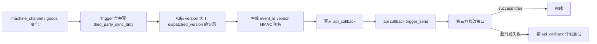

# V2 第三方商品主动同步部署说明

## 业务边界

- 嘉潮汇是调用方，主动调用第三方提供的设备商品修改接口和核心商品修改接口。
- 不新增等待第三方调用的 V2 查询接口；现有 `get_inventory_list`、`get_goods_lists` 保持原响应结构。
- 数据库 Trigger 只记录变化，不发起 HTTP；第三方故障不阻塞设备、库存、订单和商品业务。
- 仅同步 `ao_id=17` 的设备及核心商品。
- 数据库脚本以 MySQL 5.6 为兼容基线，不使用 CTE、窗口函数、JSON 类型、`SKIP LOCKED` 或同事件多 Trigger。

## 数据流



## 接收方接口地址（测试 / 生产服务器）

两个接收接口在测试、生产服务器上的完整地址如下（域名来自微程 msvc-shop 文档）：

| 环境 | 核心商品 syncGoods | 设备商品 syncMachineProduct |
|---|---|---|
| 测试服务器 | `https://test-admin-weicheng.jchtechnologies.com/msvc-shop/v1/jiachaohui/syncGoods` | `https://test-admin-weicheng.jchtechnologies.com/msvc-shop/v1/jiachaohui/syncMachineProduct` |
| 生产服务器 | `https://admin-weicheng.jchtechnologies.com/msvc-shop/v1/jiachaohui/syncGoods` | `https://admin-weicheng.jchtechnologies.com/msvc-shop/v1/jiachaohui/syncMachineProduct` |

请求方式：`POST`，`Content-Type: application/json`，UTF-8。

**测试 / 生产选择**：与微程支付（WcBase）一致，运行时按

```php
if (env("CglPay.is_test")) { /* 使用测试服务器地址 urls.test */ }
else                       { /* 使用生产服务器地址 urls.prod */ }
```

从 `config/third_party_sync.php` 的 `urls.test` / `urls.prod` 选择对应接口地址。

- syncGoods（核心商品）已按接收方实测口径对接：扁平字段，`sign=MD5(apisecret+product_id+apisecret)`；删除/下架用 `status=0` 表达（已确认：后台删除视为下架）；
- syncMachineProduct（设备商品）已按接收方实测口径对接：**明细级扁平报文**（一台售卖机 + 一个商品/货道 = 一条请求），`dispatch` 会按货道逐条生成 `api_callback`：

  | 字段 | 说明 |
  |---|---|
  | `machine_id` | 微程侧**已存在**的售卖机编号 |
  | `channel_code` | 货道编号 |
  | `product_id` / `out_no` / `g_id` | 商品 id（本地 `g_id`，需先经 syncGoods 同步到微程） |
  | `sku` / `bar_code` / `g_name` | 商品信息 |
  | `quantity` / `stock` | 可售库存（取货道快照 quantity） |
  | `sale_price` / `market_price` / `cost_price` | 价格 |
  | `status` | 货道状态 |
  | `sign` | `MD5(apisecret + machine_id + product_id + apisecret)`，32 位小写 |

  失败定位：`请求参数缺失`=报文/字段不符；`签名不合法`=`sign` 口径不符；`售卖机不存在`=`machine_id` 未在微程；`商品不存在`=`product_id` 未同步（需先 syncGoods）。

签名密钥（apisecret，文档提供）：`revrbOIz9fu0xVQbw9iDfyKkGKwiNwRs`

> 注意：接收方文档示例中的 `sign` 无法用该密钥按 `MD5(apisecret+616+apisecret)` 复算；实测确认口径为：syncGoods=`MD5(apisecret+product_id+apisecret)`、syncMachineProduct=`MD5(apisecret+machine_id+product_id+apisecret)`（均 32 位小写）。

## 配置（config/third_party_sync.php 直接维护，不使用 env 存第三方业务配置）

```php
return [
    'enabled' => false,   // 联调通过后再打开

    // 显式指定（可选）：填了则优先于 urls 分支，通常留空走下方分支
    'core_goods_url' => '',
    'machine_inventory_url' => '',

    // 测试 / 生产两套接收地址，由 env("CglPay.is_test") 自动选择
    'urls' => [
        'test' => [
            'core_goods_url' => 'https://test-admin-weicheng.jchtechnologies.com/msvc-shop/v1/jiachaohui/syncGoods',
            'machine_inventory_url' => 'https://test-admin-weicheng.jchtechnologies.com/msvc-shop/v1/jiachaohui/syncMachineProduct',
        ],
        'prod' => [
            'core_goods_url' => 'https://admin-weicheng.jchtechnologies.com/msvc-shop/v1/jiachaohui/syncGoods',
            'machine_inventory_url' => 'https://admin-weicheng.jchtechnologies.com/msvc-shop/v1/jiachaohui/syncMachineProduct',
        ],
    ],
    'secret' => 'revrbOIz9fu0xVQbw9iDfyKkGKwiNwRs',
];
```

代码内统一通过 `config('third_party_sync.xxx')` 读取。

### 服务器不可读 config 时的兜底

若某台服务器因发布方式限制无法读取/更新 `config/third_party_sync.php`，
可在 runtime 目录放置覆盖文件 `runtime/third_party_sync.local.php`（返回数组，同名键整体覆盖主配置）。
运行时 local 的显式地址优先于 `urls` 分支：

```php
<?php
// runtime/third_party_sync.local.php —— 服务器运行时覆盖
return [
    'enabled' => true,
    'core_goods_url' => 'https://admin-weicheng.jchtechnologies.com/msvc-shop/v1/jiachaohui/syncGoods',
    'machine_inventory_url' => 'https://admin-weicheng.jchtechnologies.com/msvc-shop/v1/jiachaohui/syncMachineProduct',
    'secret' => 'revrbOIz9fu0xVQbw9iDfyKkGKwiNwRs',
];
```

- 优先级：显式配置（config 顶层 / runtime local）> `urls.test` / `urls.prod` 环境分支；
- 文件不存在或返回内容不是数组时自动忽略，不影响主配置；
- 若主配置与 local 均未提供密钥/地址，则保持 `enabled=false` 安全禁用，不会向第三方误发请求。

> 密钥属服务端机密，严禁暴露到前端/客户端；不要向测试环境推送后忘记在生产核对 `CglPay.is_test`。


## 命令

单次扫描聚合任务并生成 `api_callback`：

```bash
php think third_party_sync dispatch --limit=100
```

Supervisor 常驻扫描：

```bash
php think third_party_sync dispatch --daemon --sleep=5 --limit=100
```

现有回调发送命令必须保持调度：

```bash
php think api callback trigger_send
```

首次全量或人工补偿：

```bash
php think third_party_sync machine all
php think third_party_sync machine M10001
php think third_party_sync goods all
php think third_party_sync goods 1001
```
**应用层增量扫描（方案 C / 无触发器兜底）**：定时扫描 `goods` / `machine_channel` / `machine`
的 `update_time` 变化并入 `third_party_sync_dirty`，之后由 `dispatch` 生成回调推送。
适用于不便建触发器的环境，或作为触发器方案的防漏兜底；首次运行（或游标缺失）自动执行全量引导：

```bash
# 全量引导并重置游标（首跑）
php think third_party_sync scan --limit=2000
# 日常定时增量扫描（作为兜底对账，调度频率见下方“调度方式”）
php think third_party_sync scan
# 只统计不写 dirty、不推进游标
php think third_party_sync scan --dry-run
# 强制全量引导（清空/回拨游标后对账用）
php think third_party_sync scan --full
# 指定窗口起点 unix 秒（测试/恢复水位，不持久化游标）
php think third_party_sync scan --cursor=1700000000
```

说明：
- 游标保存在缓存键 `third_party_sync_scan_cursor`，单向前进；任务间以 MySQL `GET_LOCK`
  （`third_party_sync_scan_lock`）互斥，避免并发重复扫描同一窗口。
- 窗口内对象超过 `--limit` 时当轮不推进游标，下一轮继续处理同一窗口（重复聚合仅 version+1，无害）。
- 扫描只写本地 dirty 表、不访问第三方网络，`third_party_sync.enabled=false` 时也可先聚合。
- 局限：物理删除（`goods`/`machine_channel` DELETE）无法用 update_time 捕获，建议删除采用
  `status` 下架（可捕获）或由 A 层写点显式调用 `enqueueGoods()/enqueueMachine()`；依赖业务写入
  更新 `update_time`（Model 自动时间戳 / 显式赋值）。
- 启用 scan 前先执行 `scripts/third_party_sync_scan_indexes.sql` 补齐
  `machine_channel(update_time)`、`goods(ao_id,update_time)`、`machine(ao_id,update_time)` 索引，
  否则扫描窗口查询会全表扫。

**应用层写点实时上报（方案 A）**：在业务写收口方法内直接聚合 dirty，实现秒级实时，
无需触发器也能随写即推（全变化口径，与触发器原语义一致）：

```text
机器货道：MachineChannelTrait#addMachineChannel / addMachineMoreChannel /
          updateMachineChannel / delMachineChannel
核心商品：GoodsTrait#addGoods / updateGoods / delGoods（update 时联动装载该商品的 ao17 设备）
统一上报：Kernel/Traits/ThirdParty/ThirdPartySyncReportTrait（ao_id=17 过滤、异常静默）
```

- 上报只写本地 dirty（upsert + version），不访问第三方网络；同步设施异常静默，不阻塞业务；
  在业务事务内调用时与业务同连接同事务（回滚一致）。
- `updateGoods` 内部同步修改 `machine_channel` 名称/图片时会绕过货道收口，故商品上报自动
  联动装载该商品的 ao_id=17 设备整机快照（已实现）。
- 覆盖不了的两类写由 C 层兜底：绕过 Trait 的直写 SQL、`addMoreGoods/insertAll` 批量新增
  （无法回读自增 id，但新增行 update_time 会落入扫描窗口）。
- 全变化口径说明：出货/库存等 `machine_channel` 任何 UPDATE 都会实时聚合（等价触发器），
  高频场景需评估推送量；若后续要裁剪，可在 `ThirdPartySyncReportTrait` 增加字段级过滤开关。

**调度方式（A 实时 + C 兜底对账）**：

| 环节 | 进程/调度 | 说明 |
|---|---|---|
| A 层实时入队 | 随业务写点内联执行 | 秒级，无需额外进程；与业务同事务 |
| dirty → api_callback | `third_party_sync dispatch` 常驻（Supervisor `--daemon --sleep=5`） | 只生成回调，不发 HTTP |
| 发送到微程 | `api callback trigger_send` 既有 cron 保持（如每分钟） | HTTP POST + 8 阶段重试 |
| C 层兜底对账 | `third_party_sync scan` cron 低频 | A 全量启用后建议每 10~30 分钟或每小时；无 A 覆盖/上线初期可提到每 1~5 分钟 |

```cron
# 每分钟：回调发送（既有调度保持，不要停）
* * * * * cd /home/wwwroot/kiosk && /usr/bin/php think api callback trigger_send >> runtime/log/callback_cron.log 2>&1
# 每 10 分钟：C 层增量兜底（A+C 组合推荐频率；首次/对账可临时提高频率）
*/10 * * * * cd /home/wwwroot/kiosk && /usr/bin/php think third_party_sync scan --limit=2000 >> runtime/log/third_party_scan.log 2>&1
```

- dispatch 常驻与 C 层 scan 同时运行安全：scan 只写 dirty，dispatch 行锁按版本差出回调，互不阻塞。
- 同一变化先被 A 实时入队、又被 C 重复入队时，若两次入队落在不同 dispatch 批次之间，接收方会收到
  两次内容相同的快照——接收方按 `event_id` 幂等、`version` 防乱序，不会错乱；为免无谓放大，
  A 全量启用后 C 不建议每分钟跑。
- 删除语义已确认：后台删除（`delGoods`/`delMachineChannel`）均按删除对象推送，核心商品在
  syncGoods 中以 `status=0` 表达下架；设备商品整机快照按最新状态全量覆盖。
- 全变化口径已确认（当前出货热点 QPS 不高），暂不启用字段级过滤；如需裁剪再打开
  `ThirdPartySyncReportTrait` 预留的过滤开关。

## 上线顺序

1. 备份数据库，确认数据库为 MySQL 5.6，并执行权限预检：

```sql
SELECT @@version, @@log_bin, @@log_bin_trust_function_creators, @@binlog_format;
SHOW GRANTS FOR CURRENT_USER();
SHOW TRIGGERS LIKE 'machine_channel';
SHOW TRIGGERS LIKE 'goods';
```

2. 确认六个 Trigger 名称及同表同事件没有与其他业务冲突。MySQL 5.6 开启 binary log 且 `log_bin_trust_function_creators=0` 时，普通部署账号创建 Trigger 会报1419，应采用以下方式之一：

- 推荐：由 DBA/SUPER 账号执行 SQL 中的 Trigger 部分，应用账号无需获得 SUPER。
- 备选：DBA 临时执行 `SET GLOBAL log_bin_trust_function_creators=1`，确认部署账号已有目标库 `TRIGGER` 权限，完成 Trigger 创建后立即由 DBA恢复为0。不要长期放开该全局设置。

3. 如果前一次执行已报错，可以保留已创建的 `third_party_sync_dirty` 表，修正权限后重新执行整份 SQL；脚本会按固定名称先删后建六个 Trigger。
4. 执行 `V2第三方商品主动同步数据库变更.sql`，此时配置仍保持关闭。
5. 发布 PHP 代码并执行相关文件 `php -l`、定向测试和 OpenAPI JSON 解析。
6. 在 `config/third_party_sync.php` 维护接收地址与 `secret`，先在测试环境验证签名、幂等和成功响应。
7. 启动 `third_party_sync dispatch` 常驻进程，并确认原 `api callback trigger_send` 调度正常。
8. 将 `third_party_sync.enabled` 改为 `true`，观察 `third_party_sync_dirty` 与 `api_callback` 积压。
9. 依次执行核心商品、设备商品全量同步；第三方按 `event_id` 去重，并拒绝同一对象的低版本覆盖。

## 成功判定和重试

- HTTP 状态码必须为 200。
- 响应必须明确包含 `success=true`，或兼容现有回调成功文本 `success`。
- callback type 12 为设备商品，13 为核心商品；两类均复用现有八阶段重试计划。
- 达到最大重试次数后记录状态 `cancel`，通过 `api_callback` 日志人工排查和补发。

## 回滚

1. 先将 `third_party_sync.enabled` 改为 `false`，停止同步扫描进程。
2. 停止新增 `api_callback` 后，按 SQL 文件尾部指令删除六个 Trigger。
3. 保留 `third_party_sync_dirty` 和 `api_callback` 记录用于审计；确认无需补发后再删除待同步表。
4. PHP 代码回滚不会改变 `machine_channel`、`goods` 的原有字段或业务数据。

聚合表会长期保留每个设备和商品的版本水位，不能在正常运行中清空，否则版本会重新从1开始，第三方可能按防乱序规则忽略后续事件。

## 生产验证边界

- SQL 文件提供了表和 Trigger，但不在开发机数据库自动执行。
- 上线前必须在 MySQL 5.6 测试库验证建表、六个 Trigger、INSERT、UPDATE、DELETE、事务回滚和并发更新。
- 必须使用第三方真实测试地址验证 HMAC 计算、重复事件、乱序版本、超时、5xx 和业务失败。
