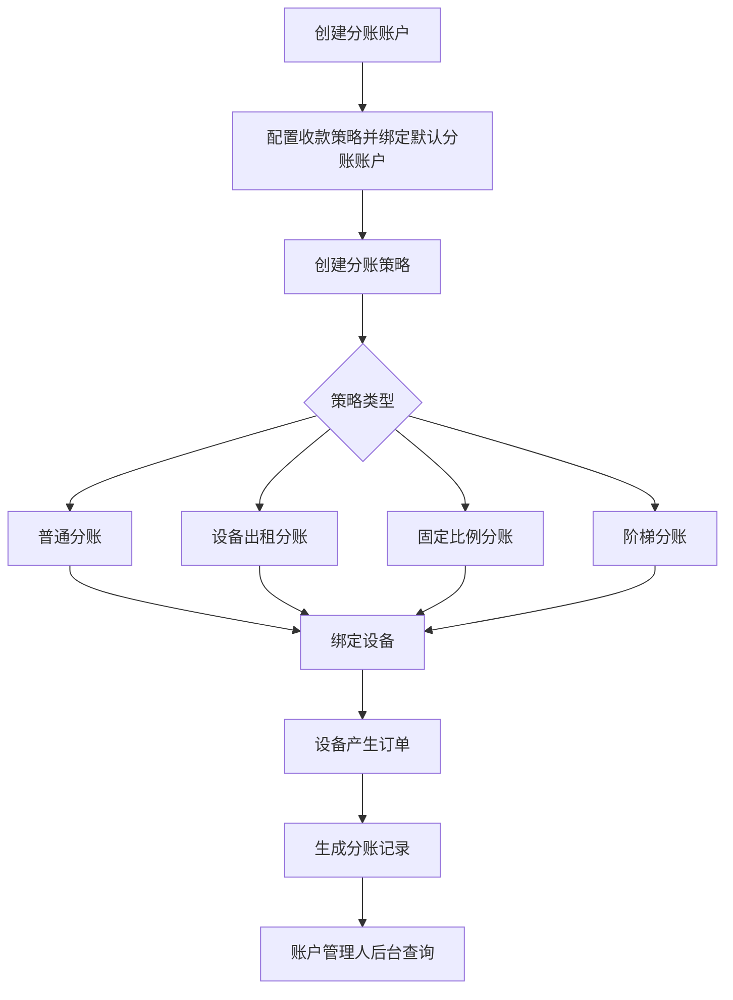

# 分账策略后台原型规划

## 1. 原型目标

后台需要让运营人员可以完成以下配置：

- 配置收款策略时绑定分账账户及账户管理人。
- 管理组织分账账户。
- 配置普通分账、设备出租分账、设备固定比例分账、设备阶梯分账。
- 将设备绑定到对应分账策略。
- 账户管理人查看自己可见的分账订单。

整体设计建议采用“先账户、再策略、再绑定设备、最后看订单”的后台路径。

## 2. 信息架构

建议在后台新增一级菜单或放入“策略管理”下：

```text
分账管理
├─ 分账账户
├─ 分账策略
├─ 设备分账绑定
└─ 分账订单
```

若不新增一级菜单，也可以并入现有“策略管理”：

```text
策略管理
├─ 收款策略
├─ 分账账户
├─ 分账策略
├─ 策略绑定设备
└─ 分账订单
```

## 3. 页面一：分账账户管理

### 3.1 列表页

用途：维护每个组织的分账账户和账户管理人。

```text
┌────────────────────────────────────────────────────────────┐
│ 分账账户                                                    │
├────────────────────────────────────────────────────────────┤
│ [组织 ▼] [账户管理人 ▼] [账户类型 ▼] [状态 ▼] [搜索] [新增] │
├────────────────────────────────────────────────────────────┤
│ 账户名称 │ 所属组织 │ 账户管理人 │ 账户类型 │ 分账账号 │ 状态 │ 操作 │
│ A默认账户│ 组织A    │ 张三       │ 余额账户 │ 138**** │ 启用 │ 编辑 停用 │
│ B分账账户│ 组织B    │ 李四       │ 京东账户 │ JD_001  │ 启用 │ 编辑 停用 │
└────────────────────────────────────────────────────────────┘
```

### 3.2 新增/编辑弹窗

```text
┌──────────────────── 新增分账账户 ────────────────────┐
│ 所属组织       [组织选择 ▼]                            │
│ 账户管理人     [管理员选择 ▼]                          │
│ 账户名称       [________________]                      │
│ 账户类型       [余额账户/银行卡/支付宝/微信/京东 ▼]      │
│ 分账账号       [________________]                      │
│ 真实姓名/户名  [________________]                      │
│ 状态           (● 启用) (○ 停用)                       │
│                                                        │
│                                  [取消] [保存]          │
└────────────────────────────────────────────────────────┘
```

交互规则：

- 账户管理人必须属于所选组织，除非业务允许跨组织管理。
- 账户类型为余额账户时，可自动取管理员余额账户。
- 账户被启用策略引用时，不允许停用，或停用前提示影响范围。

## 4. 页面二：收款策略配置增强

现有收款策略页面增加“默认分账账户”配置区。

```text
┌──────────────────── 收款策略编辑 ────────────────────┐
│ 基础信息                                                │
│ 策略名称       [________________]                      │
│ 收款组织       [组织A]                                  │
│ 支付渠道       [微信/支付宝/京东/余额 ▼]                 │
│ 商户配置       [...现有支付参数...]                      │
├────────────────────────────────────────────────────────┤
│ 默认分账账户                                            │
│ 分账账户       [A默认账户 ▼]        [新建账户]            │
│ 账户管理人     张三                                     │
│ 账户类型       余额账户                                  │
│ 分账账号       138****                                  │
│                                                        │
│                                  [取消] [保存]          │
└────────────────────────────────────────────────────────┘
```

交互规则：

- 默认分账账户为必填。
- 分账账户选择后自动带出账户管理人、账户类型、分账账号。
- 收款组织和分账账户所属组织必须一致。

## 5. 页面三：分账策略列表

用途：管理普通分账、设备出租、设备固定比例、设备阶梯分账策略。

```text
┌────────────────────────────────────────────────────────────┐
│ 分账策略                                                    │
├────────────────────────────────────────────────────────────┤
│ [策略类型 ▼] [状态 ▼] [策略名称____] [搜索] [新增策略]       │
├────────────────────────────────────────────────────────────┤
│ 策略名称       │ 策略类型     │ 收款组织 │ 规则摘要              │ 状态 │ 操作 │
│ A普通分账      │ 普通分账     │ 组织A    │ 组织A 100%             │ 启用 │ 编辑 绑定设备 停用 │
│ A代收B商品     │ 设备出租     │ 组织A    │ 商品组织全额分账        │ 启用 │ 编辑 绑定设备 停用 │
│ 设备固定分账   │ 固定比例     │ 组织A    │ B 20%，C 30%            │ 启用 │ 编辑 绑定设备 停用 │
│ 设备阶梯分账   │ 阶梯分账     │ 组织A    │ A 20/25%，B 25/30%      │ 启用 │ 编辑 绑定设备 停用 │
└────────────────────────────────────────────────────────────┘
```

点击“新增策略”后先选择策略类型：

```text
┌──────────── 选择分账策略类型 ────────────┐
│ ○ 普通分账：订单归属收款组织              │
│ ○ 设备出租：非收款组织商品全额分账        │
│ ○ 固定比例：设备订单按固定比例分账        │
│ ○ 阶梯分账：按设备当月营业额选择比例      │
│                                            │
│                         [取消] [下一步]   │
└──────────────────────────────────────────┘
```

## 6. 页面四：普通分账策略

普通分账可作为系统默认策略，也可以允许显式配置。

```text
┌──────────────────── 普通分账策略 ────────────────────┐
│ 策略名称       [组织A普通分账]                         │
│ 收款组织       [组织A ▼]                               │
│ 默认接收账户   [A默认账户 ▼]                           │
│ 账户管理人     张三                                    │
│ 分账比例       [100]%                                  │
│ 状态           (● 启用) (○ 停用)                       │
│                                                       │
│                                 [取消] [保存]          │
└───────────────────────────────────────────────────────┘
```

## 7. 页面五：设备出租分账策略

设备出租模式核心是“A 代收，商品所属组织全额获得该商品金额”。

```text
┌──────────────────── 设备出租分账策略 ────────────────────┐
│ 策略名称       [A设备出租代收]                             │
│ 收款/代收组织  [组织A ▼]                                   │
│ 分账规则       非收款组织商品按子订单金额全额分账            │
├────────────────────────────────────────────────────────────┤
│ 接收组织账户设置                                            │
│ 组织B  [B分账账户 ▼]  管理人：李四  分账：100%               │
│ 组织C  [C分账账户 ▼]  管理人：王五  分账：100%               │
│ [+ 添加允许出租商品组织]                                    │
│                                                            │
│                                  [取消] [保存]              │
└────────────────────────────────────────────────────────────┘
```

可选简化方案：

- 不在策略内逐个配置允许组织。
- 订单中只要出现 `sod_ao_id != order.ao_id`，就自动读取商品组织默认分账账户。
- 若商品组织未配置账户，则支付前拦截。

后台原型建议保留“接收组织账户设置”，方便运营提前检查哪些组织可参与设备出租。

## 8. 页面六：固定比例设备分账策略

```text
┌──────────────────── 固定比例设备分账 ────────────────────┐
│ 策略名称       [商场设备固定分账]                          │
│ 收款组织       [组织A ▼]                                  │
│ 分账基数       (● 订单总额) (○ 扣除出租商品后金额)          │
├───────────────────────────────────────────────────────────┤
│ 分账明细                                                  │
│ 接收组织 │ 分账账户       │ 账户管理人 │ 比例 │ 操作        │
│ 组织B    │ B分账账户 ▼    │ 李四       │ 20% │ 删除        │
│ 组织C    │ C分账账户 ▼    │ 王五       │ 30% │ 删除        │
│ [+ 添加分账账户]                                           │
├───────────────────────────────────────────────────────────┤
│ 当前合计比例：50%       剩余比例：50%                       │
│                                                           │
│                                  [取消] [保存]             │
└───────────────────────────────────────────────────────────┘
```

交互规则：

- 比例合计不能超过 100%。
- 同一个策略内同一分账账户不允许重复。
- 分账基数需要在保存前明确。

## 9. 页面七：阶梯分账策略

阶梯分账是固定比例分账的增强版。建议用“账户分组 + 阶梯表格”的方式呈现。

```text
┌──────────────────── 阶梯分账策略 ────────────────────┐
│ 策略名称       [设备月营业额阶梯分账]                  │
│ 收款组织       [组织A ▼]                               │
│ 统计周期       [自然月 ▼]                              │
│ 营业额口径     (● 净营业额) (○ 支付成功金额)            │
│ 命中方式       (● 本单后累计整单命中) (○ 跨阶梯拆分)    │
│ 分账基数       (● 订单总额) (○ 扣除出租商品后金额)      │
├───────────────────────────────────────────────────────┤
│ 阶梯账户 A                                             │
│ 接收组织 [组织A ▼] 分账账户 [A账户 ▼] 管理人：张三       │
│ ┌───────────────────────────────────────────────────┐ │
│ │ 营业额下限 │ 营业额上限 │ 分账比例 │ 操作          │ │
│ │ 0          │ 5000       │ 20%      │ 删除          │ │
│ │ 5000       │ 不限       │ 25%      │ 删除          │ │
│ └───────────────────────────────────────────────────┘ │
│ [+ 添加阶梯]                                           │
├───────────────────────────────────────────────────────┤
│ 阶梯账户 B                                             │
│ 接收组织 [组织B ▼] 分账账户 [B账户 ▼] 管理人：李四       │
│ ┌───────────────────────────────────────────────────┐ │
│ │ 营业额下限 │ 营业额上限 │ 分账比例 │ 操作          │ │
│ │ 0          │ 8000       │ 25%      │ 删除          │ │
│ │ 8000       │ 不限       │ 30%      │ 删除          │ │
│ └───────────────────────────────────────────────────┘ │
│ [+ 添加阶梯]                                           │
├───────────────────────────────────────────────────────┤
│ [+ 添加分账账户]                                       │
│ 当前配置校验：任一营业额阶段合计比例不能超过 100%       │
│                                                       │
│                                  [取消] [保存]         │
└───────────────────────────────────────────────────────┘
```

交互规则：

- 每个账户的阶梯区间不能重叠。
- 上一阶梯上限可自动作为下一阶梯下限。
- “不限”表示无上限。
- 系统保存前需要校验任一营业额阶段下所有账户命中比例合计不超过 100%。
- 建议提供“试算”功能。

### 9.1 阶梯试算弹窗

```text
┌──────────────────── 阶梯分账试算 ────────────────────┐
│ 设备当月已完成营业额  [4800]                           │
│ 当前订单金额          [300]                            │
│ 本单后累计营业额      5100                             │
├───────────────────────────────────────────────────────┤
│ 账户 │ 命中阶梯        │ 比例 │ 预计分账金额             │
│ A    │ 5000以上        │ 25% │ 75.00                    │
│ B    │ 8000之前        │ 25% │ 75.00                    │
├───────────────────────────────────────────────────────┤
│ 合计分账：150.00                                      │
│                                      [关闭]            │
└───────────────────────────────────────────────────────┘
```

## 10. 页面八：设备分账绑定

用途：将设备绑定到某个分账策略。

```text
┌────────────────────────────────────────────────────────────┐
│ 设备分账绑定                                                │
├────────────────────────────────────────────────────────────┤
│ [设备编号____] [设备名称____] [组织 ▼] [策略类型 ▼] [搜索]   │
├────────────────────────────────────────────────────────────┤
│ 设备编号 │ 设备名称 │ 所属组织 │ 当前收款策略 │ 当前分账策略 │ 操作 │
│ M001     │ 1号机    │ 组织A    │ 微信-A       │ 阶梯分账     │ 绑定/更换 │
│ M002     │ 2号机    │ 组织A    │ 京东-A       │ 固定比例     │ 绑定/更换 │
└────────────────────────────────────────────────────────────┘
```

绑定弹窗：

```text
┌──────────────────── 绑定分账策略 ────────────────────┐
│ 设备             M001 / 1号机                          │
│ 所属组织         组织A                                  │
│ 分账策略         [设备月营业额阶梯分账 ▼]                │
│ 生效时间         [立即生效 ▼]                            │
│ 备注             [________________]                     │
│                                                       │
│                                  [取消] [保存]          │
└───────────────────────────────────────────────────────┘
```

交互规则：

- 同一设备同一时间只能启用一个设备分账策略。
- 可保留历史绑定记录，便于追踪。
- 更换策略只影响新订单，不影响历史订单。

## 11. 页面九：分账订单查询

账户管理人后台最重要的查询入口。

```text
┌────────────────────────────────────────────────────────────┐
│ 分账订单                                                    │
├────────────────────────────────────────────────────────────┤
│ [订单号____] [设备____] [分账模式 ▼] [状态 ▼] [时间范围]    │
│ [接收组织 ▼] [账户管理人 ▼] [搜索] [导出]                  │
├────────────────────────────────────────────────────────────┤
│ 分账单号 │ 订单号 │ 设备 │ 模式 │ 接收组织 │ 账户 │ 比例 │ 金额 │ 状态 │ 操作 │
│ 10001    │ T001   │ M001 │ 阶梯 │ 组织A    │ A账户│ 25% │ 75  │ 已结算 │ 详情 │
│ 10002    │ T001   │ M001 │ 阶梯 │ 组织B    │ B账户│ 25% │ 75  │ 已结算 │ 详情 │
│ 10003    │ T002   │ M002 │ 出租 │ 组织B    │ B账户│100% │ 40  │ 待结算 │ 详情 │
└────────────────────────────────────────────────────────────┘
```

详情抽屉：

```text
┌──────────────────── 分账订单详情 ────────────────────┐
│ 订单信息                                                │
│ 订单号：T001  设备：M001  收款组织：组织A  金额：300     │
├───────────────────────────────────────────────────────┤
│ 分账信息                                                │
│ 分账模式：阶梯分账                                      │
│ 接收组织：组织A                                         │
│ 分账账户：A账户                                         │
│ 账户管理人：张三                                        │
│ 分账比例：25%                                           │
│ 分账金额：75.00                                         │
│ 状态：已结算                                            │
├───────────────────────────────────────────────────────┤
│ 阶梯命中快照                                            │
│ 周期：2026-06                                           │
│ 本单前累计：4800.00                                     │
│ 本单后累计：5100.00                                     │
│ 命中阶梯：5000以上                                      │
├───────────────────────────────────────────────────────┤
│ 商品明细                                                │
│ 商品 │ 商品组织 │ 子订单金额 │ 退款金额                  │
│ ...                                                   │
└───────────────────────────────────────────────────────┘
```

## 12. 推荐配置流程



## 13. 原型交互优先级

### 必须实现

- 分账账户管理。
- 收款策略绑定默认分账账户。
- 固定比例分账策略。
- 阶梯分账策略。
- 设备绑定策略。
- 分账订单查询。

### 建议实现

- 阶梯分账试算。
- 策略影响设备数量提示。
- 停用账户或策略时的影响范围提示。

### 后续增强

- 分账策略复制。
- 批量绑定设备。
- 策略版本管理。
- 可视化阶梯图表。

