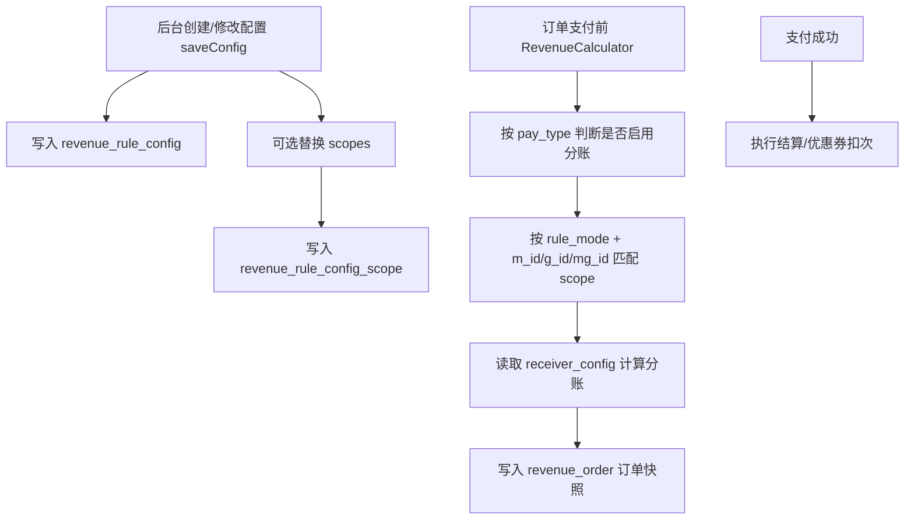

# 统一分账后台接口说明

新版分账配置以两张表为核心：

- `revenue_rule_config`：保存配置主体、接收方 JSON、优惠券字段、结算字段。
- `revenue_rule_config_scope`：保存配置在哪些设备、商品或设备商品上生效。

旧接口名保留兼容，推荐新页面优先使用 `saveConfig` 和 `saveScope`。

## 配置流程



## 推荐接口

| 接口 | 作用 | 主要读写 |
| --- | --- | --- |
| `/management/revenue.revenue_rule/saveConfig` | 新增或修改统一分账配置。支持 `rule_mode=1,2,3,4,5` 五种场景，一次提交主配置、接收方、优惠券字段和生效范围。 | 写 `revenue_rule_config`，可写 `revenue_rule_config_scope` |
| `/management/revenue.revenue_rule/saveScope` | 单独替换某个配置的生效范围。适合后台页面单独维护设备/商品范围。 | 写 `revenue_rule_config_scope` |
| `/management/revenue.revenue_rule/getList` | 查询配置列表，返回兼容字段 `rr_id/rule_name/machine_num/receivers` 和完整 `scopes`。 | 查 `revenue_rule_config`、`revenue_rule_config_scope` |
| `/management/revenue.revenue_rule/getFind` | 查询单个配置详情，包含 `receivers` 和完整 `scopes`。 | 查 `revenue_rule_config`、`revenue_rule_config_scope` |
| `/management/revenue.revenue_rule/getBoundMachineList` | 查询某配置已绑定的设备范围。 | 查 `revenue_rule_config_scope` + `machine` |
| `/management/revenue.revenue_pay_channel/add` | 新增分账触发支付类型。传 `pay_type`，`channel_name` 可为空，后台按支付类型说明补全。 | 写 `revenue_pay_channel` |
| `/management/revenue.revenue_pay_channel/update` | 修改分账触发支付类型。可调整 `pay_type/channel_name/status`。 | 写 `revenue_pay_channel` |

## 兼容接口

| 接口 | 作用 | 新版行为 |
| --- | --- | --- |
| `/management/revenue.revenue_rule/add` | 兼容旧新增策略接口。 | 等同 `saveConfig` 新增 |
| `/management/revenue.revenue_rule/update` | 兼容旧修改策略接口。 | 等同 `saveConfig` 更新 |
| `/management/revenue.revenue_rule/addItem` | 兼容旧新增接收方明细。 | 向 `receiver_config` 追加一项 |
| `/management/revenue.revenue_rule/updateItem` | 兼容旧修改接收方明细。 | 按 `rr_id/rrcfg_id + rri_id/item_key` 修改 `receiver_config` |
| `/management/revenue.revenue_rule/addProductItem` | 兼容旧设备商品明细。 | 等同 `addItem`，通常传 `g_id/mg_id` |
| `/management/revenue.revenue_rule/getItemList` | 查询接收方配置。 | 解析 `receiver_config` 返回 |
| `/management/revenue.revenue_rule/delItem` | 删除接收方配置。 | 从 `receiver_config` 删除一项 |
| `/management/revenue.revenue_rule/addTier` | 新增阶梯区间。 | 向 `receivers[].tiers` 追加一项 |
| `/management/revenue.revenue_rule/updateTier` | 修改阶梯区间。 | 修改 `receivers[].tiers` 中一项 |
| `/management/revenue.revenue_rule/getTierList` | 查询阶梯区间。 | 返回指定接收方的 `tiers` |
| `/management/revenue.revenue_rule/delTier` | 删除阶梯区间。 | 从指定接收方的 `tiers` 删除一项 |
| `/management/revenue.revenue_rule/bindMachine` | 兼容旧绑定设备接口。 | 向 `revenue_rule_config_scope` 新增设备范围 |
| `/management/revenue.revenue_rule/getMachineList` | 查询范围列表。 | 查询 `revenue_rule_config_scope` |
| `/management/revenue.revenue_rule/unbindMachine` | 解绑范围。 | 删除 `revenue_rule_config_scope` |
| `/management/revenue.revenue_rule/saveCouponConfig` | 兼容旧保存优惠券配置。 | 更新 `rule_mode=5` 的 `revenue_rule_config` |
| `/management/revenue.revenue_rule/getCouponConfig` | 兼容旧查询优惠券配置。 | 查询 `rule_mode=5` 配置并返回 scopes |

## 五种场景

| rule_mode | 场景 | 配置方式 |
| --- | --- | --- |
| `1` | 基础/设备分账 | `receivers` 配置接收方比例/全额/阶梯；`scopes` 配置生效设备、商品或设备商品。新配置统一使用该场景承接原普通分账和设备分账。 |
| `2` | 设备出租分账 | `receivers.receiver_ao_id` 对应商品归属组织；`scopes` 可配置设备、商品或设备商品。 |
| `3` | 设备分账历史兼容 | 仅兼容旧配置读取和计算；新后台不建议继续新增，改用 `rule_mode=1`。 |
| `4` | 设备商品分账 | `receivers` 或 `scopes` 中配置 `g_id/mg_id` 限定商品 |
| `5` | 优惠券分账 | 券码、优惠金额/比例、次数都在 `revenue_rule_config`；生效范围在 `scopes` |

## 生效范围 scopes 存储规则

所有 `rule_mode=1,2,4,5` 都使用 `revenue_rule_config_scope` 作为唯一生效范围来源，`rule_mode=3` 仅作为历史兼容同样读取该表。

| m_id | g_id | mg_id | 含义 |
| ---: | ---: | ---: | --- |
| `0` | `0` | `0` | 全部设备 + 全部商品 |
| `>0` | `0` | `0` | 指定设备 + 全部商品 |
| `0` | `>0` | `0` | 全部设备 + 指定商品 |
| `>0` | `>0` | `0` | 指定设备 + 指定商品 |
| `>0` | `>0` | `>0` | 精确到设备商品库记录 |

匹配优先级：

```text
设备商品精确 > 设备+商品 > 设备全商品 > 全设备商品 > 全局
```

`machine_id` 和 `ao_id` 是展示快照，核心关联以 `m_id/g_id/mg_id` 为准。传入 `mg_id` 时，后台会反查并校验对应 `m_id/g_id`，避免设备商品范围配置不一致。

完整请求字段和五种场景示例见：

`文档说明/统一分账后台接口.apifox.openapi.json`
