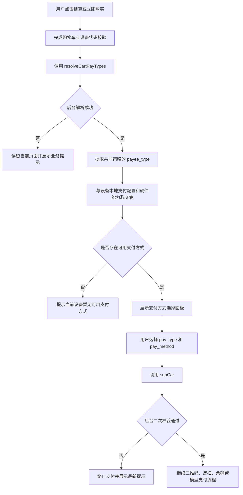

# 设备商品多收款策略——设备端待更新文档

## 1. 文档信息

| 项目 | 内容 |
| --- | --- |
| 适用项目 | `robot_flutter` 设备端 |
| 关联需求 | 一个设备商品可配置多个收款策略，购物车按商品策略集合交集展示支付方式 |
| 后台接口 | `POST /machine/receive/resolveCartPayTypes`、`POST /machine/receive/subCar` |
| 编制日期 | 2026-08-12 |
| 当前状态 | 核心代码已编码，待 Flutter 静态检查、接口联调和真机验收 |

## 2. 改造目标

设备端不能再只依赖启动时缓存的设备支付配置展示收款方式。用户每次结算时，应将当前购物车提交后台，由后台计算所有商品可用收款策略的交集，再由设备端结合本机支付能力生成最终可选支付方式。

设备端只负责展示支付类型和交互方式，不负责选择具体收款策略 `sp_id`。具体策略由后台在 `subCar` 二次校验时确定并固化到订单。

## 3. 总体流程



## 4. 设备端需要调整的模块

### 4.1 订单接口层

文件：`robot_flutter/lib/api/order/order.dart`

新增接口方法：

```dart
OrderApi.resolveCartPayTypes(list: submitList)
```

请求地址：

```http
POST /machine/receive/resolveCartPayTypes
```

请求仍由公共 HTTP 层补充 `msg_id`、`machine_id`、`timestamp`、`sign` 和请求头 `mac`。业务参数：

```json
{
  "carList": "[{\"mc_id\":1001,\"quantity\":1,\"channel_code\":\"A01\"}]"
}
```

要求：

- 使用和 `subCar` 完全相同的购物车转换方法，避免两次请求商品数据不一致；
- 实物商品必须提交真实 `mc_id`；
- 线上商品继续携带 `channel_code=Z10` 以及既有线上商品字段；
- 不向后台提交或缓存 `sp_id`；
- 接口失败时不得继续打开支付方式面板。

当前状态：已完成接口封装，待联调。

### 4.2 支付方式模型

文件：`robot_flutter/lib/model/pay_type.dart`

`PayType.options` 增加本次购物车允许的原始支付类型集合：

```dart
PayType.options(
  context,
  allowedRawPayeeTypes: strategyPayeeTypes,
)
```

最终展示集合为：

```text
后台返回的共同策略 payee_type
∩ machineConfig 缓存的设备启用支付类型
∩ 设备扫码、读卡器、余额、积分等实际能力
∩ 当前页面允许的支付方式
```

要求：

- 相同 `payee_type` 的多个策略只展示一次支付类型；
- 微信、支付宝可根据设备能力继续区分正扫和反扫；
- 不展示策略名称、策略ID或具体商户名称；
- 保留既有积分、余额、MDB卡和模型支付能力判断；
- 购物车入口继续隐藏免支付选项，避免改变其他业务入口。

当前状态：已完成过滤参数和去重逻辑，待回归所有支付类型。

### 4.3 购物车结算入口

文件：`robot_flutter/lib/pages/goods_cart/index.dart`

调整后的调用顺序：

1. 检查购物车非空；
2. 检查取货箱、重复入住日期、登录状态和外链商品；
3. 完成活动、优惠券等既有校验；
4. 加载设备本地支付能力 `PayType.get()`；
5. 调用 `resolveCartPayTypes`；
6. 从 `payTypeList` 提取并去重 `payee_type`；
7. 调用 `PayType.options` 生成最终支付方式；
8. 单一方式直接进入支付，多种方式显示选择面板；
9. 用户选择后调用既有 `submit/subCar` 流程。

当前状态：已完成核心调用和过滤，待 Flutter analyze、页面回归和真机验证。

### 4.4 商品详情“立即购买”入口

文件：`robot_flutter/lib/pages/goods_detail/index.dart`

“立即购买”同样会创建购物车订单，必须在打开内嵌支付面板前调用策略解析接口。流程应与购物车保持一致，不允许一个入口按新规则、另一个入口仍展示设备全部支付方式。

当前状态：已完成核心调用和过滤，待页面及预取流程回归。

### 4.5 `subCar` 提交

设备端继续提交原字段：

```json
{
  "carList": "...",
  "pay_type": 1,
  "pay_method": 1
}
```

禁止新增以下行为：

- 不提交 `sp_id`；
- 不根据第一次解析结果自行决定收款商户；
- 不因第一次解析成功而忽略 `subCar` 失败；
- 不在本地长期缓存购物车策略结果。

后台会在 `subCar` 中重新计算策略交集，并按用户选择的 `pay_type` 确定最终唯一 `sp_id`。如果配置在两次请求之间发生变化，设备端应以 `subCar` 最新响应为准。

## 5. 接口响应与展示规则

### 5.1 成功响应示例

```json
{
  "state": 200,
  "msg": "查询成功",
  "data": {
    "effective_sp_id": 0,
    "strategy_source": "goods_explicit",
    "payTypeList": [
      {
        "sp_id": 18,
        "sp_name": "微信收款策略",
        "payee_type": 1
      },
      {
        "sp_id": 21,
        "sp_name": "支付宝收款策略",
        "payee_type": 2
      }
    ]
  }
}
```

设备端仅使用 `payee_type` 生成支付方式。`sp_id` 和 `sp_name` 只允许用于脱敏调试日志，不得展示给消费者，也不得回传作为选中策略。

### 5.2 三个商品匹配到两个共同策略

若共同策略分别为微信和支付宝，设备端展示设备实际支持的微信、支付宝支付方式。

若两个共同策略均为微信，设备端只展示一组微信方式；正扫和反扫是否同时展示仍由设备能力决定。用户选择微信后，后台按策略排序确定最终 `sp_id`。

### 5.3 无可用支付方式

后台解析成功但经过设备能力过滤后为空时：

- 不调用 `subCar`；
- 不创建订单；
- 提示“当前设备暂无可用支付方式”；
- 记录后台返回类型和本机启用类型，便于排查配置不一致。

## 6. 异常处理要求

| 场景 | 设备处理 |
| --- | --- |
| 商品策略集合交集为空 | 停留当前页面，提示“购物车商品属于不同收款策略，请分开结算” |
| 商品独立策略停用或支付类型不匹配 | 停止结算，展示后台业务提示 |
| 商品和设备均无可用策略 | 停止结算，提示联系管理员配置收款策略 |
| 货道不属于当前设备或商品已变化 | 停止结算，引导用户刷新或重新选择商品 |
| 解析接口网络超时 | 不打开支付面板，提示网络异常并允许重试 |
| `subCar` 二次校验失败 | 不继续拉起支付，展示最新后台提示 |
| 页面在请求期间被关闭或MQ切走 | 检查 `mounted` 和当前路由，不在旧页面弹窗或继续提交 |

业务异常不应自动回退到设备全部支付方式，否则可能进入错误收款商户。

## 7. 日志与排障

建议在现有运行日志体系中记录：

- `machine_id`；
- 当前页面和触发入口；
- 购物车 `mc_id`、数量和商品数量；
- 后台返回的 `sp_id` 列表和 `payee_type` 列表；
- 设备本地启用的支付类型；
- 最终展示的支付方式；
- 用户选择的 `pay_type/pay_method`；
- 解析接口或 `subCar` 的失败文案。

不得记录：

- 收款策略密钥、证书或完整配置内容；
- 用户完整付款码、手机号或支付凭证；
- 可用于重放签名的敏感数据。

## 8. 兼容性要求

### 8.1 旧设备版本

旧设备不会调用 `resolveCartPayTypes`，只能看到 `machineConfig` 的静态支付方式。后台 `subCar` 必须继续进行强制二次校验，因此旧设备可能在选择支付方式后收到策略不匹配提示。

上线建议：

- 在设备端新版本覆盖完成前，不给旧设备配置多商品差异化策略；
- 或先限制后台配置入口，只允许已升级设备启用；
- 不允许后台为兼容旧设备而关闭 `subCar` 校验。

### 8.2 未配置独立策略的商品

设备端仍调用解析接口；后台返回原设备/商品组织策略。最终展示应与改造前保持一致。

### 8.3 A组织设备销售B组织商品

设备端不判断组织，也不根据商品组织选择支付方式。所有组织与策略匹配由后台完成，设备只消费后台返回的共同支付类型。

### 8.4 零金额和积分订单

- 普通零金额订单继续沿用现有免拉起支付流程；
- 积分兑换属于真实支付能力，必须经过策略解析；
- 优惠券将应付金额抵扣为零时，不应因动态支付面板引入重复提交；
- 上述流程需与现有零元购、积分及优惠券用例一起回归。

## 9. 验收测试清单

### 9.1 支付方式展示

- [ ] 三个商品共同策略为微信、支付宝，设备展示两类支付方式；
- [ ] 三个商品共同策略为两个微信策略，设备只展示微信；
- [ ] 后台共同策略含微信、支付宝，但设备仅启用微信，只展示微信；
- [ ] 设备不具备反扫能力时不展示反扫；
- [ ] 本机支付能力与后台策略无交集时提示无可用支付方式。

### 9.2 购物车策略

- [ ] 所有商品未配置独立策略时，展示结果与旧逻辑一致；
- [ ] 多商品策略集合交集非空时允许结算；
- [ ] 多商品策略集合交集为空时不创建订单；
- [ ] 部分商品使用独立策略、部分使用旧逻辑且存在交集时允许结算；
- [ ] A组织设备销售B组织商品时，展示后台解析出的支付类型；
- [ ] 线上、线下商品限制继续符合 `subcar_mix` 配置。

### 9.3 二次校验

- [ ] 解析成功后后台停用策略，`subCar` 能拒绝创建订单；
- [ ] 解析成功后后台修改商品策略，设备能展示 `subCar` 最新错误；
- [ ] 篡改 `pay_type` 时后台拒绝；
- [ ] 设备端不传 `sp_id` 仍能正常下单并由后台固化策略。

### 9.4 回归测试

- [ ] 购物车单一支付方式直接提交；
- [ ] 多支付方式选择面板；
- [ ] 商品详情立即购买；
- [ ] 微信/支付宝正扫、反扫；
- [ ] 积分、余额、MDB卡和模型支付；
- [ ] 优惠券全额抵扣和普通零金额订单；
- [ ] 预取货、取货箱检测、登录和线上商品流程；
- [ ] 页面被MQ切换后不继续弹窗或重复提交。

## 10. 发布前检查

- [ ] 后台已部署 `resolveCartPayTypes`；
- [ ] 数据库多策略关联表和迁移数据已核验；
- [ ] Apifox接口响应与设备端解析字段一致；
- [ ] `flutter analyze` 无新增错误；
- [ ] 目标设备架构构建成功；
- [ ] 测试环境完成至少微信、支付宝各一笔真实支付；
- [ ] 完成支付取消、支付失败和退款回归；
- [ ] 验证日志不包含支付密钥和付款码；
- [ ] 分批升级设备，未升级设备暂不开放差异化多策略配置。

## 11. 当前代码完成情况

| 模块 | 当前状态 | 后续动作 |
| --- | --- | --- |
| `OrderApi.resolveCartPayTypes` | 已编码 | 接口联调 |
| `PayType.options`动态过滤 | 已编码 | 全支付类型回归 |
| 购物车结算入口 | 已编码 | Flutter检查、页面及真机测试 |
| 商品详情立即购买入口 | 已编码 | Flutter检查、预取及支付面板回归 |
| `subCar`请求字段 | 沿用现有协议 | 联调后台二次校验 |
| 错误提示 | 已接入后台异常 | 补多语言及产品文案确认 |
| 运行日志 | 已有基础失败日志 | 补策略集合和最终展示结果日志 |
| 自动化测试 | 后端守卫已覆盖 | 补Flutter单元/组件测试 |

## 12. 本期不由设备端承担的职责

- 不校验策略所属组织；
- 不读取策略密钥或完整收款配置；
- 不决定最终 `sp_id`；
- 不拆分多商户订单；
- 不绕过后台 `subCar` 二次校验；
- 不改变支付回调、退款、分账和订单审计逻辑。
