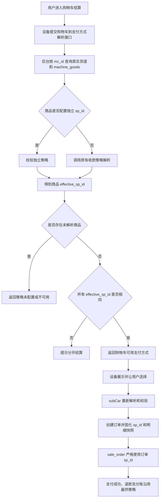

# 设备商品独立收款策略需求说明及处理方案

## 一、文档信息

| 项目 | 内容 |
| --- | --- |
| 文档名称 | 设备商品独立收款策略需求说明及处理方案 |
| 适用项目 | JCH 后台、设备端 `robot_flutter`、支付服务 |
| 当前分支 | `machine_goods_paystrategy` |
| 编制日期 | 2026-08-12 |
| 当前阶段 | 已完成代码实现与静态验证，待数据库连通、联调及设备验收 |

## 二、需求背景

当前收款策略主要以设备为入口配置。设备启动或刷新配置时获取设备支持的支付类型及收款策略，设备端在提交购物车前展示支付方式，用户选择后，设备调用 `subCar` 创建订单，随后调用 `/pay/payment/sale_order` 发起支付。

现需要支持在“设备商品”维度配置独立收款策略，使某些商品可以指定独立的收款商户和支付方式。同时必须兼容以下既有业务：

> A 组织的设备中可以销售 B 组织的商品，B 组织商品现有的收款或收益归属逻辑不能因新增商品独立收款策略而被覆盖。

本次方案的核心原则是：

> 商品显式独立策略集合优先；商品未配置独立策略时，完整沿用现有收款策略解析；购物车对各商品策略集合求交集，支付时从交集中固化一个有效 `sp_id`。

## 三、需求目标

1. 支持每个设备商品配置多个独立收款策略，并配置优先级。
2. 结算前根据购物车商品动态返回本次可用支付方式。
3. `subCar` 创建订单时再次校验收款策略，防止设备绕过。
4. 商品未配置独立策略时，不改变当前设备、商品组织及租赁组织相关的收款逻辑。
5. 同一购物车内商品可用策略集合没有交集时，阻止整单支付并提示分开结算。
6. 订单保存最终收款策略和解析来源，保证支付、退款、分账及历史审计一致。
7. 不修改新分账对最终支付结果的读取边界；新分账继续读取订单最终 `sp_id`、`pay_type` 和支付金额。

## 四、非目标

本期不包含以下能力：

- 一次支付同时进入多个商户。
- 自动将一个购物车拆成多个订单并分别支付。
- 跨商户聚合支付、合并退款或多商户退款编排。
- 默认改变已有设备的收款策略配置。
- 用商品独立策略替换或删除历史设备策略、组织策略或租赁分账规则。

## 五、术语定义

| 术语 | 定义 |
| --- | --- |
| 设备默认收款逻辑 | 当前通过设备、`strategy_machine`、组织范围、支付类型和排序选择 `strategy_payee` 的逻辑。 |
| 商品独立策略 | 设备商品通过 `machine_goods_payee_strategy` 显式关联的一个或多个 `strategy_payee.sp_id`。 |
| 收费商品 | 对订单应付金额或积分支付产生实际影响的商品明细；零金额赠品默认不参与策略冲突判断。 |
| 原逻辑解析 | 商品未配置独立策略时调用的兼容解析流程，包含设备、商品组织、租赁组织和现有策略绑定规则。 |
| 最终策略 | 单个商品或整笔订单最终解析得到的 `effective_sp_id`。 |
| 策略来源 | 最终策略来自商品显式配置，还是设备、商品组织、租赁组织等历史逻辑。 |
| 支付类型 | `strategy_payee.payee_type`，如微信、支付宝、京东、积分、余额。 |
| 支付方式 | 正扫、反扫、POS/模型支付等设备交互方式，对应 `pay_method`。 |

## 六、当前收款逻辑梳理

### 6.1 设备端支付方式来源

设备调用 `machineConfig` 获取：

- `machine_config.pay_type`：设备允许展示的支付类型；
- `payTypeList`：由设备绑定的 `strategy_machine.s_type=1` 和启用的 `strategy_payee` 生成；
- 支付名称、图标及 `payee_type`。

设备端将其保存到全局 `PayType`，用户结算时先展示支付方式，再调用 `subCar`。

### 6.2 `subCar` 当前职责

`subCar` 当前接收：

- `carList`；
- `pay_type`；
- `pay_method`；
- 手机号、取货码等业务字段。

后台根据实际货道和设备商品创建 `sale_orders` 与 `sale_orders_details`。当前订单创建阶段没有按设备商品独立配置确定最终 `sp_id`。

### 6.3 支付阶段当前职责

`/pay/payment/sale_order` 当前根据以下主要条件查询收款策略：

- `strategy_machine.s_type=1`；
- `strategy_machine.m_id=当前设备`；
- `strategy_payee.status=1`；
- `strategy_payee.payee_type=订单支付类型`；
- 必要时限制 `strategy_machine.ao_id`；
- 多条策略按现有排序选择。

选中后写入 `sale_orders.sp_id`，再执行实际支付、生成分账订单以及后续支付回调。

### 6.4 商品组织归属

订单明细的 `sod_ao_id` 当前按以下顺序解析：

1. 调用方显式传入的有效 `sod_ao_id`；
2. `machine_goods.ao_id`；
3. 设备租赁组织；
4. `sale_orders.ao_id`，即订单主组织。

因此，A 组织设备销售 B 组织商品时通常形成：

```text
sale_orders.ao_id = A
machine_goods.ao_id = B
sale_orders_details.sod_ao_id = B
```

需要注意：当前分支代码明确证明 `sod_ao_id` 用于商品归属和设备出租分账，但支付接口没有直接按 `sod_ao_id` 查询 B 的收款策略。目标环境中“B 商品按 B 收款策略收款”的实际效果，可能依赖同一设备存在 B 组织的 `strategy_machine` 绑定及排序，也可能存在部署代码差异。实施前必须用真实订单和配置数据确认。

## 七、需求规则

### 7.1 原始需求

1. 设备已配置收款策略、设备商品未配置独立策略时，按当前逻辑收款。
2. 设备已配置收款策略、设备商品配置多个独立策略时，只展示所有商品策略交集对应的支付方式。
3. 设备未配置收款策略时，只有购物车所有商品都配置策略且策略集合交集不为空才允许收款，否则抛出异常。
4. 设备未配置收款策略且任意商品未配置独立策略时，提示未配置。

### 7.2 完善后的核心规则

原始规则中的“设备商品是否配置”应升级为“各收费商品可用策略集合是否存在交集”。

每个收费商品按以下顺序解析：

```text
商品显式独立策略集合
    ↓ 未配置
完整的现有收款逻辑
    ↓ 无法解析
返回未配置异常
```

整单校验规则：

```text
所有收费商品均得到非空策略集合
且所有策略集合的交集不为空
才允许创建订单和支付
```

设备展示交集中策略对应的支付类型。用户选择支付类型后，后台按商品配置顺序从交集中固化唯一 `sp_id`；两个微信策略可能属于不同商户，因此最终订单仍必须且只能保存一个明确的 `sp_id`。

## 八、完整场景矩阵

| 编号 | 设备默认策略 | 商品独立策略及原逻辑解析 | 处理结果 |
| --- | --- | --- | --- |
| S01 | 有 | 所有商品均未配置独立策略 | 完整沿用当前收款逻辑。 |
| S02 | 有 | 所有收费商品显式策略集合存在交集 | 使用交集策略，只展示交集对应支付方式。 |
| S03 | 有 | 部分商品显式配置，未配置商品按原逻辑解析后与显式策略相同 | 允许结算。 |
| S04 | 有 | 部分商品显式配置，未配置商品按原逻辑解析后与显式策略不同 | 拒绝，提示不同收款策略。 |
| S05 | 有 | 所有商品显式配置，但策略集合交集为空 | 拒绝，提示不同收款策略。 |
| S06 | 无 | 所有收费商品显式策略集合存在交集 | 使用交集中的策略正常收款。 |
| S07 | 无 | 所有商品均未配置，原逻辑也无法解析 | 拒绝，提示设备及商品均未配置策略。 |
| S08 | 无 | 部分商品显式配置，其他商品无法由原逻辑解析 | 拒绝，提示商品策略配置不完整。 |
| S09 | 任意 | 策略不存在、停用或配置内容无效 | 拒绝，不得静默回退。 |
| S10 | 任意 | 策略有效，但支付类型与设备提交值不一致 | 拒绝，提示所选支付方式不匹配。 |
| S11 | 任意 | 策略有效，但设备硬件不支持相应支付方式 | 拒绝，提示设备不支持。 |
| S12 | 任意 | 所有商品最终策略相同，但来源不同 | 允许，例如显式策略与原逻辑恰好都解析为同一 `sp_id`。 |
| S13 | 任意 | 普通零元订单 | 不拉起现金支付；是否要求策略按零元规则处理。 |
| S14 | 任意 | 积分兑换，现金金额为零 | 仍需有效积分收款策略并完成真实积分扣减。 |
| S15 | 任意 | 存在多个组织商品，但最终 `sp_id` 相同 | 允许结算。 |
| S16 | 任意 | 存在多个组织商品且最终 `sp_id` 不同 | 拒绝或未来拆单；本期拒绝。 |

## 九、A 设备销售 B 商品的兼容规则

### 9.1 全部为 B 组织商品，均未配置独立策略

必须继续调用原有收款解析，保持 B 商品当前收款或收益归属行为，不能简单回退到 A 组织设备策略。

### 9.2 全部为 B 组织商品，配置同一独立策略

使用该独立策略，但必须验证：

- 策略属于 B 组织或已授权 B 组织使用；
- 策略状态有效；
- 当前设备允许使用；
- 支付类型及支付方式与设备能力兼容。

### 9.3 A、B 商品混合，最终策略相同

允许整单支付。例如：

```text
A 商品按原逻辑解析为 S1
B 商品显式配置为 S1
最终全部为 S1
```

### 9.4 A、B 商品混合，最终策略不同

本期拒绝支付。原因是：

- `sale_orders.sp_id` 只能保存一个策略；
- 一次支付只能进入一个收款商户；
- 支付回调、撤销和退款依赖订单唯一 `sp_id`；
- 强行选择任一策略都会导致另一组织商品进入错误商户。

设备提示：

> 购物车商品属于不同收款策略，请分开结算。

## 十、业务流程



## 十一、数据设计

### 11.1 增加设备商品—收款策略关联表

多策略采用关联表，完整 SQL见《设备商品多收款策略数据库变更.sql》：

```sql
CREATE TABLE `machine_goods_payee_strategy` (
  `id` int unsigned NOT NULL AUTO_INCREMENT,
  `mg_id` int NOT NULL,
  `sp_id` int NOT NULL,
  `sort` int NOT NULL DEFAULT 1,
  `status` tinyint NOT NULL DEFAULT 1,
  PRIMARY KEY (`id`),
  UNIQUE KEY `uk_mg_sp` (`mg_id`,`sp_id`)
);
```

选择设备商品关联表而不是 `machine_channel` 的原因：

- 同一设备商品可能上架到多个货道；
- 商品策略应保持一致，避免同商品不同货道产生配置漂移；
- `subCar` 已能通过 `machine_channel.mg_id` 找到设备商品。
- 一个设备商品可按顺序关联多个 `sp_id`，且便于约束、查询和审计。

`machine_goods`不增加 `sp_id`字段，商品与策略关系全部以关联表为准。接口仍可兼容接收单值请求参数 `sp_id`，但只转换为单元素集合写入关联表。

### 11.2 订单主表

继续使用：

```text
sale_orders.sp_id
```

用于保存整单最终唯一收款策略。

### 11.3 订单明细策略快照

推荐在 `sale_orders_details` 增加：

```sql
ALTER TABLE `sale_orders_details`
ADD COLUMN `source_sp_id` int NOT NULL DEFAULT 0
COMMENT '下单时设备商品显式配置的收款策略ID，0表示未配置',
ADD COLUMN `effective_sp_id` int NOT NULL DEFAULT 0
COMMENT '该订单明细最终解析得到的收款策略ID',
ADD COLUMN `payee_source` varchar(32) NOT NULL DEFAULT ''
COMMENT '策略来源：goods_explicit/legacy_device/legacy_goods_org/legacy_rental_org';
```

若暂时不能准确区分历史逻辑内部来源，`payee_source` 第一阶段可只支持：

- `goods_explicit`；
- `legacy`。

后续再细分，不建议在无法证明来源时写入错误标签。

### 11.4 外键和删除规则

本项目现有表未普遍使用强外键，建议保持现有风格，通过应用层验证 `sp_id`。删除或停用策略时必须检查是否被设备商品引用，至少返回引用数量并阻止直接物理删除。

## 十二、后台管理改造

### 12.1 设备商品列表及详情

设备商品列表、详情接口增加：

- `sp_ids`；
- `sp_names`；
- `payee_types`；
- `payee_type_name`；
- `strategy_status`。

### 12.2 新增和修改设备商品

新增可选字段：

```json
{
  "sp_ids": [18, 21]
}
```

规则：

- 空数组表示不配置独立策略；旧参数 `sp_id` 仍兼容为单元素数组；
- 每个 ID 都必须存在于 `strategy_payee`；
- 策略必须启用；
- 当前后台账号必须有权查看和选择该组织的策略；
- 策略组织必须与设备商品组织兼容；
- 更新成功后沿用现有 `updateMg` 通知机制刷新设备商品。

### 12.3 策略下拉列表

不能直接返回所有组织的收款策略。建议根据：

- 设备商品 `ao_id`；
- 当前管理员数据权限；
- 策略状态；
- 必要时当前设备授权范围；

返回可选择列表。

### 12.4 多商品批量配置

新增接口：

```http
POST /management/machine.machine_goods/updatePayeeStrategiesBatch
```

```json
{
  "mg_ids": [5001, 5002, 5003],
  "sp_ids": [18, 21]
}
```

接口采用整体替换语义，`sp_ids=[]`表示批量清空独立策略。后台必须先校验全部商品存在、账号有设备权限、全部策略启用且与每个商品组织兼容，再在同一数据库事务中更新关联表；任一商品失败时不得部分成功。纯策略配置不更新 `machine_goods`，也不触发设备商品主表刷新通知。单次最多配置500个商品、每个商品最多50个策略。

## 十三、设备接口改造

### 13.1 新增结算前支付方式解析接口

建议接口：

```text
POST /machine/receive/resolveCartPayTypes
```

请求示例：

```json
{
  "carList": [
    {
      "mc_id": 123,
      "channel_code": "A01",
      "quantity": 1
    }
  ]
}
```

安全要求：

- 不接收设备提交的可信 `sp_id`；
- 必须根据 `mc_id`、设备身份和真实数据库重新查询；
- 必须校验货道属于当前设备；
- 必须忽略设备伪造的商品组织和价格字段。

成功响应示例：

```json
{
  "state": 200,
  "data": {
    "strategy_source": "goods_explicit",
    "effective_sp_id": 18,
    "payTypeList": [
      {
        "sp_id": 18,
        "sp_name": "B组织商品专用微信收款",
        "title": "微信支付",
        "payee_type": 1,
        "ico": "https://example.com/pay-wechat.png",
        "pay_methods": [1, 2]
      }
    ]
  }
}
```

### 13.2 `subCar` 二次校验

`subCar` 必须复用同一个策略解析服务：

1. 查询真实货道；
2. 查询真实设备商品；
3. 解析商品显式策略或原有策略；
4. 校验所有收费商品最终策略一致；
5. 校验设备提交的 `pay_type/pay_method` 属于可用列表；
6. 创建订单；
7. 写入 `sale_orders.sp_id`；
8. 写入订单明细策略快照。

不允许只依赖结算前接口结果，因为策略、商品或设备配置可能在两次请求之间发生变化。

### 13.3 响应兼容

现有 `subCar` 响应字段保持不变，可新增：

```json
{
  "effective_sp_id": 18,
  "strategy_source": "goods_explicit"
}
```

设备端不得把这些字段用于绕过后端支付校验，仅用于日志和展示。

## 十四、设备端改造

### 14.1 当前问题

当前设备端先根据本地 `PayType` 展示支付方式，再调用 `subCar`。仅在 `subCar` 中校验无法做到“按购物车动态展示支付方式”。

### 14.2 推荐流程

1. 用户点击结算。
2. 设备调用 `resolveCartPayTypes`。
3. 后台返回本购物车唯一策略对应的支付类型及方式。
4. 设备仅展示本次返回的选项。
5. 用户选择后调用 `subCar`。
6. 后端再次校验。

### 14.3 支付方式生成规则

最终展示方式应为：

```text
最终策略对应 payee_type
∩ 设备硬件支持的 pay_method
∩ 当前业务模式允许的支付能力
```

例如商品策略为微信时，可以根据设备能力展示：

- 微信正扫；
- 微信反扫；
- 或仅其中一种。

不能仅用 `strategy_payee.payee_type` 判断设备一定具备反扫或 POS 能力。

### 14.4 异常处理

解析失败时设备应停留购物车页面，不创建订单，并展示后台返回的明确提示。

## 十五、支付接口改造

支付阶段应区分两种订单：

### 15.1 已固化最终策略的订单

如果 `sale_orders.sp_id > 0`：

- 严格使用订单 `sp_id`；
- 校验策略仍存在、启用、配置有效；
- 校验 `payee_type` 与订单支付类型匹配；
- 校验组织及设备使用范围；
- 不重新按排序选择另一个策略；
- 校验失败时不得回退。

### 15.2 历史订单或未固化策略的订单

如果 `sale_orders.sp_id = 0`：

- 继续使用当前设备收款策略查询逻辑；
- 保证历史接口、历史订单和其他非 `subCar` 下单入口兼容。

### 15.3 撤销、退款和回调

必须继续使用订单固化的 `sp_id`：

- 微信回调 `attach`；
- 支付宝异步查询；
- 取消支付；
- 原路退款；
- 后台手动退款；
- 定时任务；
- 设备出货失败自动退款。

不得根据商品最新配置重新解析，否则历史订单可能退款到错误商户。

## 十六、原逻辑解析服务设计

建议新增统一服务，例如：

```text
CartPayeeStrategyResolver
```

主要职责：

- 查询购物车真实商品；
- 判断收费商品；
- 解析商品显式策略；
- 调用历史策略解析；
- 校验策略可用性；
- 聚合并判断最终 `sp_id` 是否唯一；
- 生成可用支付方式；
- 输出可用于订单快照的解析结果。

建议返回结构：

```php
[
    'effective_sp_id' => 18,
    'payee_type' => 1,
    'strategy_source' => 'goods_explicit',
    'pay_methods' => [1, 2],
    'items' => [
        [
            'mc_id' => 123,
            'mg_id' => 456,
            'goods_ao_id' => 20,
            'source_sp_id' => 18,
            'effective_sp_id' => 18,
            'payee_source' => 'goods_explicit',
        ],
    ],
]
```

结算前接口与 `subCar` 必须复用该服务，禁止复制两套判断逻辑。

## 十七、特殊场景

### 17.1 普通零元订单

- 原价即为零的普通商品不应要求现金收款策略。
- 优惠券或满减后变成零元时不拉起第三方支付。
- 可以保留创建订单时解析出的 `sp_id` 作为业务快照，但不得因此调用第三方收款。

### 17.2 积分兑换

积分兑换即使现金金额为零，仍属于真实支付流程：

- 必须解析积分类型策略；
- 必须完成积分扣减；
- 不能误走普通零元完成逻辑。

### 17.3 优惠券和满减

当前优惠券、满减可能发生在 `subCar` 后。策略解析不能只根据提交购物车时最终应付金额判断是否需要支付；支付前仍应以订单最新金额和订单类型为准。

### 17.4 赠品

默认只有零金额且不单独收款的赠品不参与策略一致性判断。若赠品具有独立应付金额或积分成本，则应作为收费商品参与。

### 17.5 组合商品及套餐

- 按实际收费明细判断；
- 若组合商品只能整包支付，则组合内所有收费明细必须解析为同一策略；
- 不同策略时本期拒绝，不自动拆单。

### 17.6 微程线上商品

Z10 微程商品可能不存在有效 `machine_goods.mg_id`。如果本期需要支持微程商品独立策略，还需为微程商品或设备微程货道增加对应策略映射。

若本期只支持普通线下设备商品，应明确：

> 微程线上商品暂不支持设备商品独立收款策略，继续沿用现有线上商品收款逻辑。

## 十八、异常提示建议

| 场景 | 建议提示 |
| --- | --- |
| 商品无法解析策略 | 当前商品未配置可用收款策略，请联系管理员 |
| 部分商品无法解析 | 购物车商品收款策略配置不完整，请分开结算或联系管理员 |
| 多个最终策略 | 购物车商品属于不同收款策略，请分开结算 |
| 商品策略不存在或停用 | 商品独立收款策略不存在或已停用 |
| 策略配置错误 | 商品独立收款策略配置无效，请联系管理员 |
| 支付类型不匹配 | 所选支付方式与商品收款策略不匹配，请重新选择 |
| 设备能力不支持 | 当前设备不支持该支付方式 |
| 设备及商品均未配置 | 设备及商品均未配置可用收款策略 |
| 暂不支持的线上商品 | 当前线上商品暂不支持独立收款策略 |

建议同时提供稳定业务错误码，设备端按错误码处理，中文文案由后台返回。

## 十九、权限和安全要求

1. 后台账号只能选择有权访问组织的收款策略。
2. B 组织商品不得由无权限的 A 组织管理员随意绑定其他组织策略。
3. 设备端不得提交可信 `sp_id`、组织 ID、商品价格或策略状态。
4. 所有策略必须以后端实时数据为准。
5. 策略配置内容不得下发敏感商户密钥，仅下发支付名称、类型、图标和允许方式。
6. 日志记录 `order_id/machine_id/mg_id/goods_ao_id/source_sp_id/effective_sp_id/payee_source`，不得记录支付密钥或证书内容。

## 二十、测试方案

### 20.1 核心决策表测试

必须覆盖 S01-S16 全部场景，重点包括：

- 全部未配置并沿用当前逻辑；
- 全部配置同一策略；
- 部分配置但最终策略相同；
- 部分配置且最终策略不同；
- 策略停用、删除、配置 JSON 错误；
- 支付类型或支付方式不匹配；
- 设备没有默认策略；
- 多组织商品混合。

### 20.2 A/B 组织兼容测试

至少构造：

1. A 设备 + A 商品；
2. A 设备 + B 商品；
3. A 设备 + A/B 商品，最终同一策略；
4. A 设备 + A/B 商品，最终不同策略；
5. B 商品无显式策略；
6. B 商品有显式策略；
7. B 商品绑定无权策略；
8. B 商品策略下单后的退款和分账。

验证字段：

```text
sale_orders.ao_id
sale_orders.sp_id
sale_orders.pay_type
sale_orders.pay_method
sale_orders_details.sod_ao_id
sale_orders_details.source_sp_id
sale_orders_details.effective_sp_id
sale_orders_details.payee_source
strategy_machine.s_id/m_id/ao_id/sort
strategy_payee.sp_id/ao_id/payee_type/status
```

### 20.3 支付生命周期测试

- 正扫支付；
- 反扫支付；
- 余额支付；
- 积分兑换；
- 普通零元；
- 优惠券后零元；
- 满减后零元；
- 支付取消；
- 全额退款；
- 部分商品退款；
- 出货失败自动退款；
- 支付回调重复通知；
- 支付发起前策略被停用。

### 20.4 兼容性测试

- 未使用商品独立策略的现有设备无行为变化；
- 历史订单 `sp_id=0` 的查询、退款或补偿逻辑不受影响；
- 非 `subCar` 创建的订单入口继续使用原逻辑；
- 新分账只读取最终支付结果，不修改旧收款策略；
- PHP 7 语法检查；
- 设备旧版本无法识别新增字段时仍能读取原响应。

## 二十一、实施步骤

### 阶段一：事实确认

1. 选取一笔真实的“A 设备、B 商品”历史订单。
2. 查询订单、明细、设备商品、设备策略绑定和收款策略。
3. 确认支付资金实际进入的商户。
4. 区分“B 组织直接收款”和“支付后向 B 分账”。
5. 将目标环境的真实旧逻辑固化成回归用例。

### 阶段二：数据库和后台配置

1. 增加 `machine_goods_payee_strategy`，不修改 `machine_goods`表结构。
2. 增加订单明细策略快照字段。
3. 扩展设备商品列表、详情、新增、修改和批量修改。
4. 增加策略选择权限和有效性校验。
5. 增加数据库变更 SQL 和回退说明。

### 阶段三：统一策略解析服务

1. 封装现有逻辑为兼容解析方法。
2. 实现商品显式策略解析。
3. 实现购物车最终策略聚合。
4. 实现支付方式能力过滤。
5. 添加确定性单元/守卫测试。

### 阶段四：接口和设备端

1. 增加 `resolveCartPayTypes`。
2. `subCar` 复用解析服务并固化策略。
3. 设备端在展示支付方式前调用解析接口。
4. 设备端按返回结果展示支付方式。
5. 完善错误码和多语言文案。

### 阶段五：支付、退款和分账回归

1. 支付接口优先使用订单固化 `sp_id`。
2. 撤销、退款、回调、定时任务继续使用订单策略。
3. 验证普通零元和积分兑换互斥。
4. 验证新分账结果和设备出租规则。
5. 完成 Apifox/OpenAPI 文档。

## 二十二、上线与回退

### 22.1 上线顺序

1. 备份相关表结构和策略引用数据。
2. 执行兼容性数据库变更，新增字段默认值均为 0 或空。
3. 发布后台代码和支付代码。
4. 发布支持动态支付方式解析的设备端版本。
5. 先不给任何商品配置独立策略，验证历史逻辑不变。
6. 选择测试设备和少量商品灰度配置。
7. 验证支付、退款、分账后逐步扩大范围。

### 22.2 回退原则

- 清空 `machine_goods_payee_strategy`对应商品关联，即可停止商品独立策略生效；
- 保留订单历史策略快照，不应清理已产生订单的 `sp_id`；
- 回退设备端时，后台仍应兼容旧设备使用原 `machineConfig` 支付方式；
- 不删除已用于历史订单的收款策略。

## 二十三、验收标准

1. 未配置商品独立策略的设备和商品，支付行为与上线前一致。
2. 各收费商品策略集合存在交集时，设备展示交集对应的支付方式。
3. 策略集合交集为空时，结算前明确阻止且不创建订单。
4. `subCar` 能识别伪造支付类型、支付方式或货道信息并拒绝。
5. 订单 `sp_id` 与每条收费明细 `effective_sp_id` 一致。
6. A 设备销售 B 商品的既有行为通过真实订单回归。
7. 支付、取消、退款、回调和分账始终使用订单固化策略。
8. 普通零元不错误拉起支付，积分兑换仍真实扣积分。
9. 策略停用或配置变更不会静默切换到其他商户。
10. 后台权限无法跨组织越权配置商品策略。

## 二十四、待确认事项

以下事项确认后才能冻结开发范围：

1. A 设备销售 B 商品时，现网是“B 商户直接收款”还是“A 商户收款后向 B 分账”。
2. 本期“设备商品”是否包含 Z10 微程线上商品。
3. 组合商品、套餐是否按组合主体还是实际收费明细配置策略。
4. 零金额赠品是否完全不参与策略判断。
5. 商品策略是否必须绑定当前设备，还是只需组织授权即可使用。
6. 部分商品配置独立策略、其他商品按旧逻辑解析到同一 `sp_id` 时，是否接受混合结算；本方案建议接受。
7. 不同策略商品是明确禁止混购，还是未来要求自动拆单；本期建议禁止。
8. 旧版设备是否必须继续支持；如必须支持，需要定义旧设备无法动态展示商品支付方式时的降级策略。

## 二十五、当前验证边界

- 已基于当前分支代码梳理 `machineConfig`、`subCar`、`PaymentClient::orderPay()`、设备端 `PayType` 及订单明细组织归属逻辑。
- 已只读检查 `.envMock` 中 `machine_goods`、`machine_channel`、`strategy_payee`、`strategy_machine`、`sale_orders`、`sale_orders_details` 和 `machine_config` 表结构。
- 当前尚未查询一笔真实 A/B 组织订单及其支付商户流水。
- 当前尚未修改业务代码、数据库、设备端代码或接口文档。
- 当前结论不等于已完成真实支付、退款、设备或生产验证。
